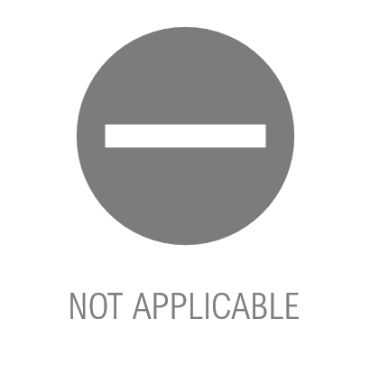
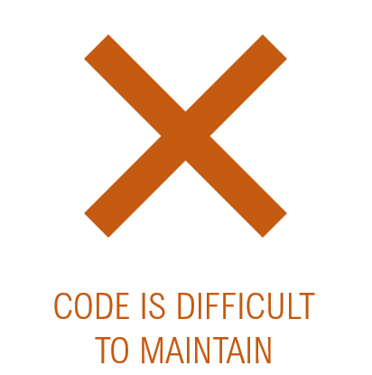
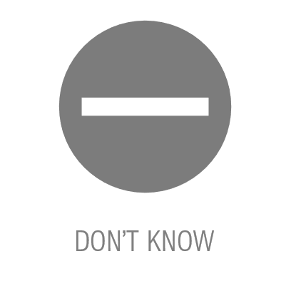
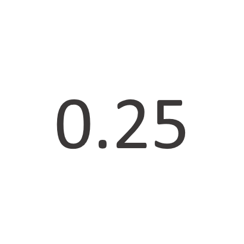

```{r setup, include=FALSE}
knitr::opts_chunk$set(echo = TRUE)
```

```{r, include = FALSE, echo = FALSE}

library(readstata13)
library(tidyverse)
library(RColorBrewer)

base <- 
    expand.grid(1:9, c(0:3, -6)) %>%
    rename(practice = Var1,
           value = Var2) %>%
    mutate(value = factor(value,
                          levels = c(-6, 0, 1, 2, 3),
                          labels = c("Not applicable",
                                     "Not used",
                                     "Can improve a lot",
                                     "Can improve a little",
                                     "Perfectly implemented")),
           practice = factor(practice, 
                             labels = c( "Use of functions (abstraction)",
                                         "Naming conventions",
                                         "Use of white space",
                                         "Use of loops",
                                         "Use of comments",
                                         "Use of documentation",
                                         "Code organization",
                                         "Folder organization",
                                         "Master script"),
                             ordered = T))

data <- read.dta13("../Data/Code Review Summary - Identified.dta")

obs <- data[20, ]

practices <-
  pivot_longer(obs %>% select(starts_with("practice_")),
               cols = starts_with("practice_"),
               names_to = "practice") %>%
    mutate(practice = factor(practice,
                              levels = c( "practice_abstraction",
                                          "practice_names",
                                          "practice_white",
                                          "practice_loops",
                                          "practice_comments",
                                          "practice_doc",
                                          "practice_org",
                                          "practice_folder",
                                          "practice_master"),
                                labels = c( "Use of functions (abstraction)",
                                            "Naming conventions",
                                            "Use of white space",
                                            "Use of loops",
                                            "Use of comments",
                                            "Use of documentation",
                                            "Code organization",
                                            "Folder organization",
                                            "Master script"),
                                ordered = T))
```


\titleBox{
\textcolor{white}{\Large{\textbf{`r obs$project` -- `r obs$stage`}}} \\
\vspace{.5cm}
\textcolor{white}{\Large{Peer Code Review Summary}} \\
\vspace{.1cm}
\textcolor{white}{\Large{DIME Analytics, June 2020}}}

\begin{center}
\large{

\textbf{Principal Investigator:} `r obs$ttl`

\textbf{Research Assistant:} `r obs$ra`

\textbf{Software used:} `r obs$software`

}
\end{center}

\vspace{.3cm}

# Project diagnostic

\begin{tabular}{rlrl}
```{r, echo=FALSE, out.width = '32%'}
  knitr::include_graphics("img/code.png")  
```
& 
```{r, echo=FALSE, out.width = '15%'}
if (obs$reproducibility == "Yes, everything ran smoothly") {
  knitr::include_graphics("img/code1.png")  
} else 
if (obs$reproducibility == "Not entirely") {
  knitr::include_graphics("img/codeno.png")  
} else  {
  knitr::include_graphics("img/code2.png")  
}
```
&
```{r, echo=FALSE, out.width = '32%'}
  knitr::include_graphics("img/output.png")  
```
&
```{r, echo=FALSE, out.width = '15%'}
if (obs$outputs == "Yes, from the beginning") {
  knitr::include_graphics("img/output1.png")  
} else 
if (obs$outputs == "Yes, after some fixes") {
  knitr::include_graphics("img/output2.png")  
} else 
if (obs$outputs == "Not applicable") {
    
} 

```
\\
```{r, echo=FALSE, out.width = '32%'}
  knitr::include_graphics("img/read.png")  
```
&
```{r, echo=FALSE, out.width = '15%'}
if (obs$readability == "Yes, easily") {
  knitr::include_graphics("img/read1.png")  
} else 
if (obs$readability == "Yes, after a few questions") {
  knitr::include_graphics("img/read2.png")  
} else  
if (obs$readability =="Not all  of it") {
  knitr::include_graphics("img/readno.png")  
}
```
&
```{r, echo=FALSE, out.width = '32%'}
  knitr::include_graphics("img/maintain.png")  
```
&
```{r, echo=FALSE, out.width = '15%'}
if (obs$maintain == "Very easy") {
  knitr::include_graphics("img/veasy.png")  
} else 
if (obs$maintain == "Easy") {
  knitr::include_graphics("img/easy.png")  
} else 
if (obs$maintain == "Hard") {
    
} else
if (obs$maintain == "Very hard") {
  knitr::include_graphics("img/vhard.png")  
} else 
if (obs$maintain == "Don't know") {
    
}
```
\\
```{r, echo=FALSE, out.width = '32%'}
  knitr::include_graphics("img/transfer.png")  
```
&
```{r, echo=FALSE, out.width = '12%'}
if (obs$newradays == 0.25) {
    
} else {
  knitr::include_graphics(paste0("img/days", obs$newradays, ".png"))  
} 
```
& & \\
\end{tabular}

# Code feedback

**Code strenghts:** `r obs$strengths`

**Areas for improvement:** `r obs$improvement`

**Additional feedback:** `r obs$extrafeedback`


# Adoption of best practices

```{r, echo = FALSE}
ggplot() +
    geom_line(data = base,
              aes(x = value,
                  y = practice,
                  group = practice),
              size = 1.5) +
    geom_point(data = base,
               aes(x = value,
                   y = practice,
                   group = practice),
               size = 5,
               color = "black") + 
  geom_point(data = base,
              aes(x = value,
                  y = practice,
                  group = practice),
              size = 3.5,
             color = "white") +
    geom_point(data = practices,
               aes(y = practice,
                   x = value,
                   color = value),
               size = 3.5) + 
    scale_x_discrete(position = "top") +
   scale_color_manual(values = c("grey", 
                                 "red",
                                 "yellow", 
                                 "lightgreen", 
                                 "darkgreen"), 
                       breaks = c("Not applicable",
                                  "Not used", 
                                  "Can improve a lot", 
                                  "Can improve a little",
                                  "Perfectly implemented")) +
    theme(legend.position = "none",
          axis.title = element_blank(),
          panel.grid = element_blank(),
          panel.background = element_blank(),
          axis.ticks = element_blank(),
          axis.text.x = element_text(angle = 10))
```
